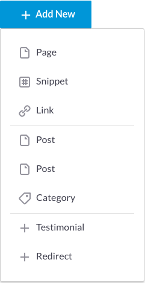
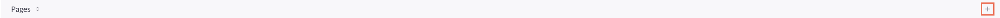
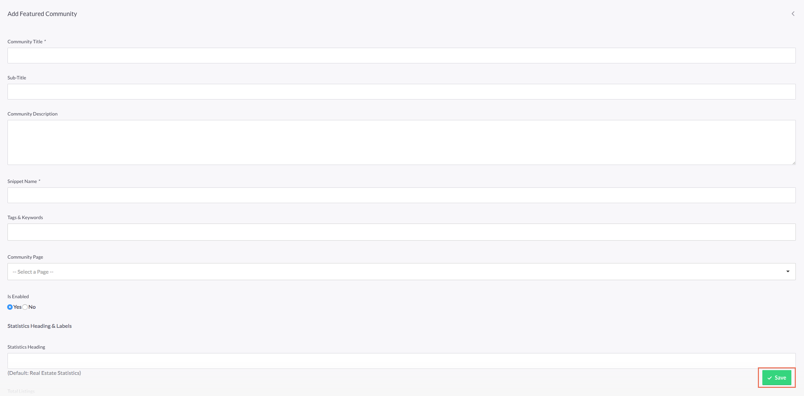
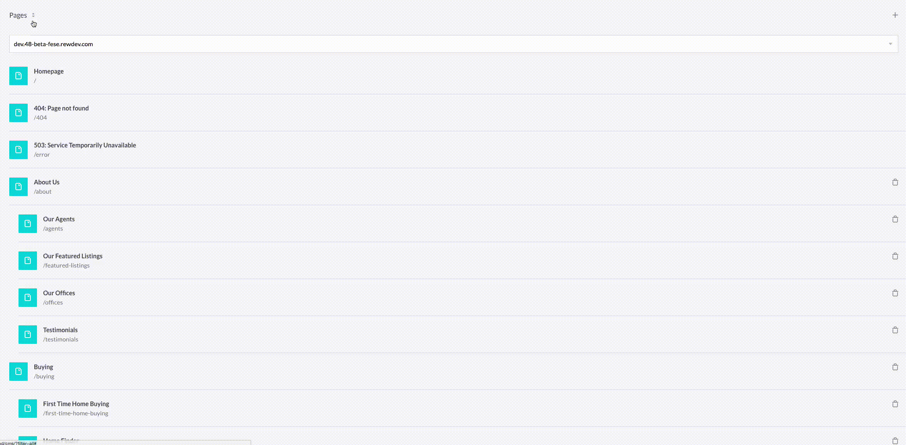
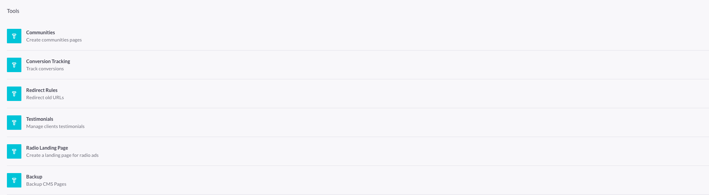

# Content (CMS)

Jump to:
- [Adding/Editing content](#adding-editing-content)
- [Section Sorting](#section-sorting)
- [Snippets](#snippets)
- [Tools](#tools)

### Adding/Editing Content

The __Add New__ button can be used as shortcut to add new content.

The __+__ icon on the right can also be used to add new content

To add or update content click the __Save__ button that is located at the bottom right of the edit pages.

The location of the __Save__ button is consistent within the CRM

### Section Sorting

Click on the title of the current section to sort the content being displayed.

### Snippets

All available snippets are present on the page and the list can be sorted using the context menu.

Once the list has been sorted a snippet is added to that specific category (e.g IDX, Modules, Forms).

### Tools

Communities, Slideshow images, Testimonials, etc., are located under tools.

