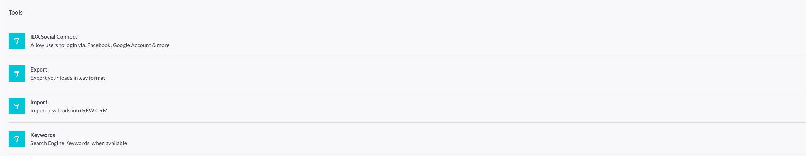

# CRM

Jump to:
- [Tools](#tools)
- [Exporting Leads](#exporting-leads)

### Tools

Developer tasks such as social network login access and exporting leads can be found under the tools section.

### Exporting Leads

To export leads:

1. Select the specific agent whose leads you want to export.
2. Add the data that you need to export for the leads to the list.
3. Update the `.CSV` file name if required.
4. Click the __Download__ button to get a copy of the CSV file.

