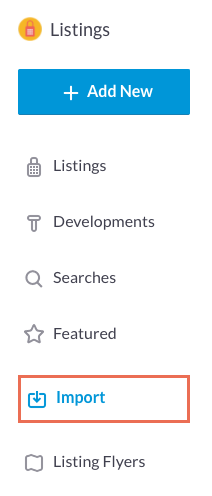
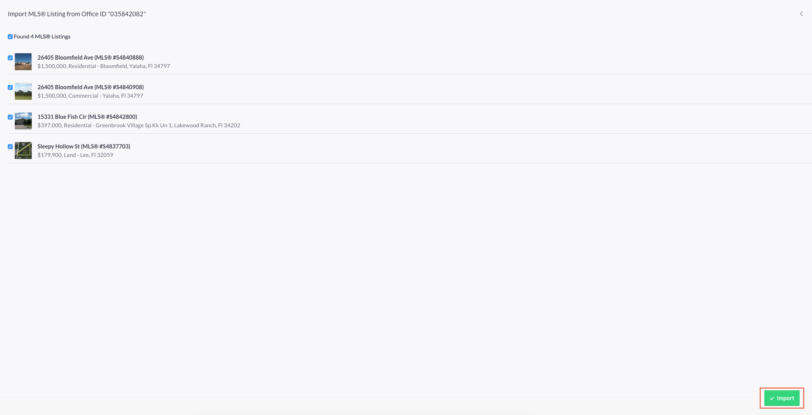

# Listings

Jump to:
- [Adding a Custom IDX Search](#adding-a-custom-idx-search)
- [Adding a Featured Listing](#adding-a-featured-listing)
- [Importing a Listing](#importing-a-listing)
- [Tools](#tools)

### Adding a Custom IDX Search

To add a new IDX search:

1. Navigate to the __New Custom Search__ page.
2. Create a title for the new custom search.
3. Add the required search panels and update configurations if needed.
4. Click the __Save__ button, the new custom search should appear on the __IDX Searches__ list.

### Adding a Featured Listing

To add a featured listing:

1. Search for a listing using the Address or MLS #.
2. Select the appropriate listing.
3. Click the __Save__ button.

Newly added listings appear on the __Featured Listings__ list

### Importing a Listing

1. MLS® Listings can either be imported by office or agent.
2. Once your preferred method has been chosen you will be redirected to a page that shows all associated listings.
3. Select the listings you wish to import.
4. Click the __Import__ button.

